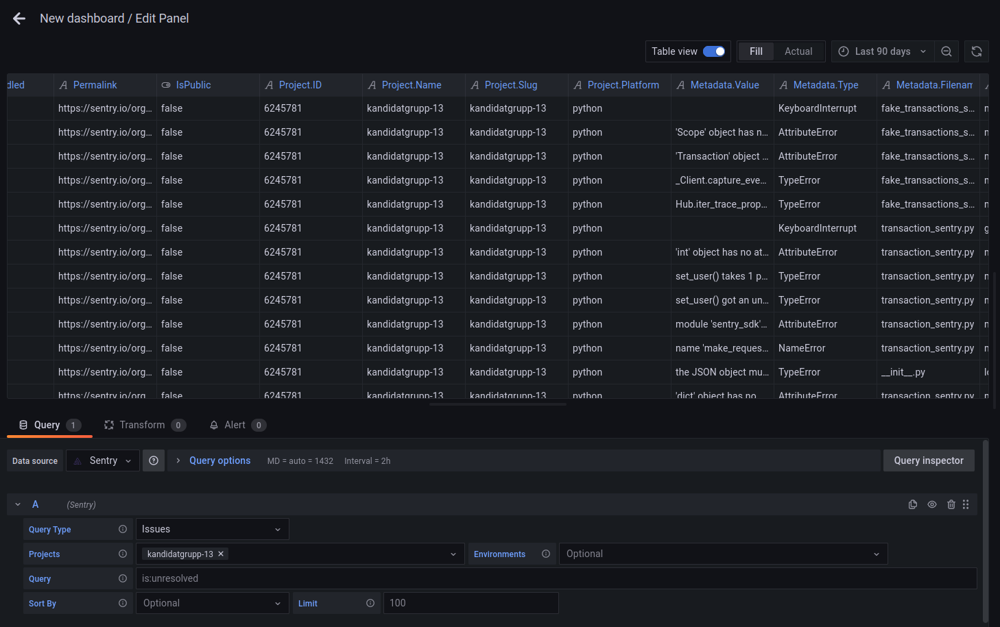
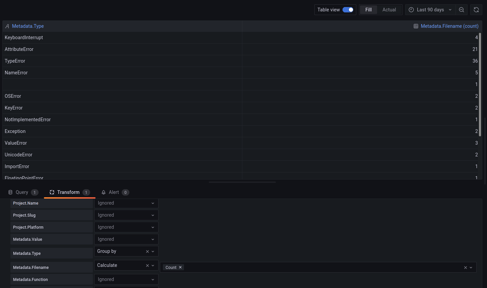

# Transformations

Transformations is used to change data from data sources, in Grafana, for a specific query. For example, transformations can be used to hide, filter, group and sort rows in a table.

!!! example
    Let's say you are using Sentry as your data source. As seen in the picture, you will obtain a table with **very** many rows:

    

    By using a `Group by`-transform, we can group the data by its kind of exception. We will also add a calculation (`count`) for the field `Filename` (in our case what field we use doesn't matter because count will return the number of existing elements) to obtain a column where it says how many of the given exception that exists:

    
