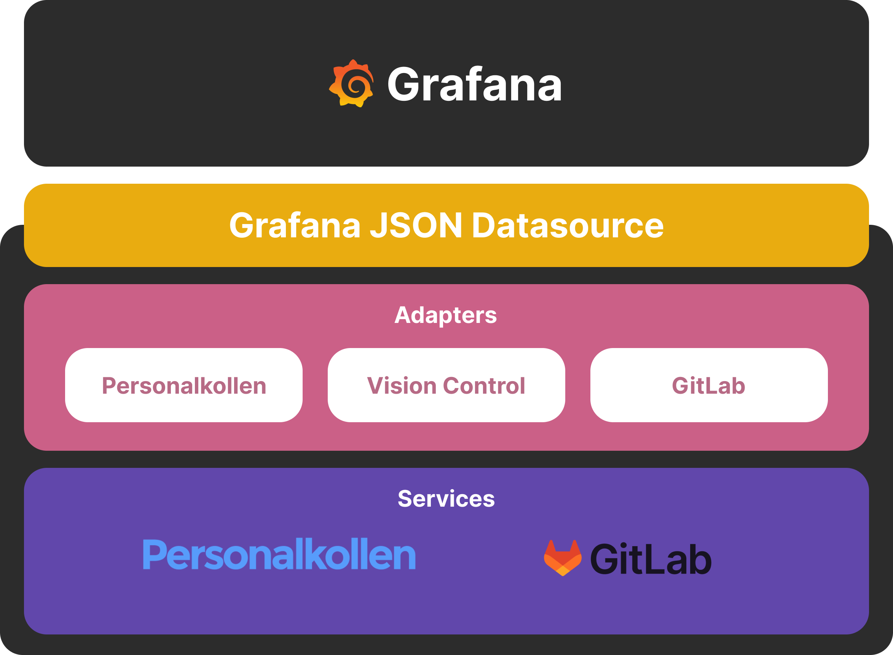
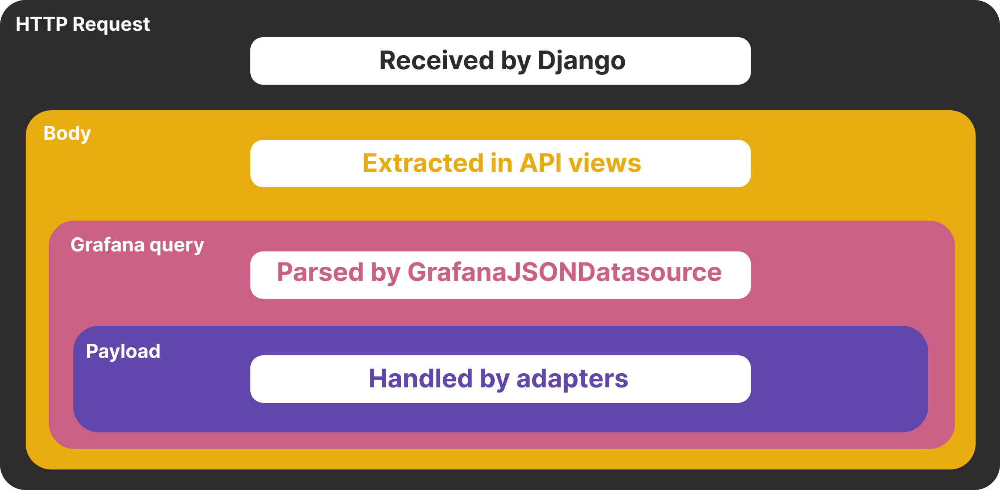
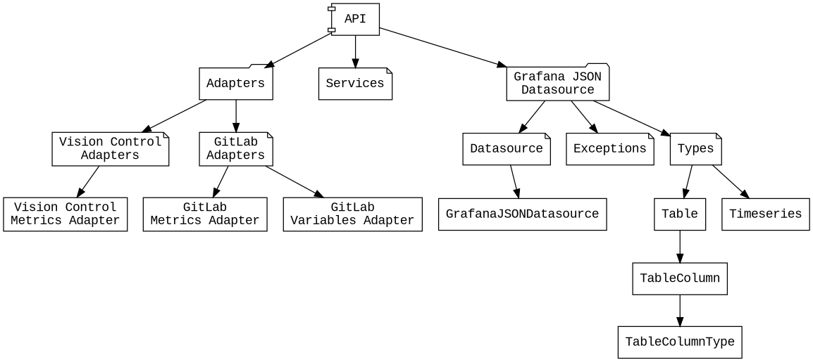
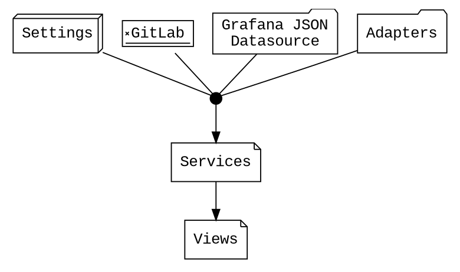
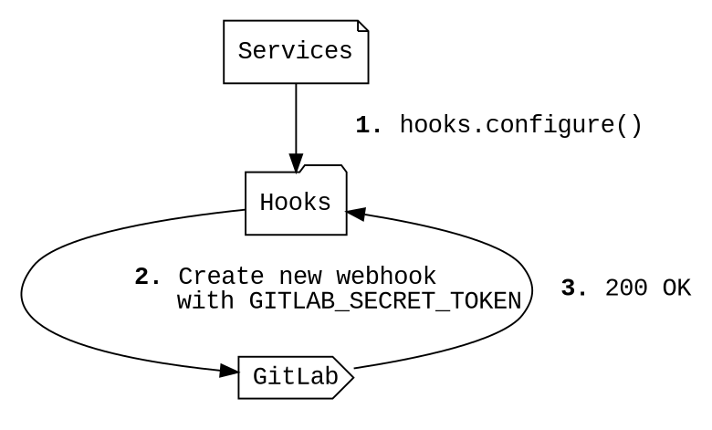
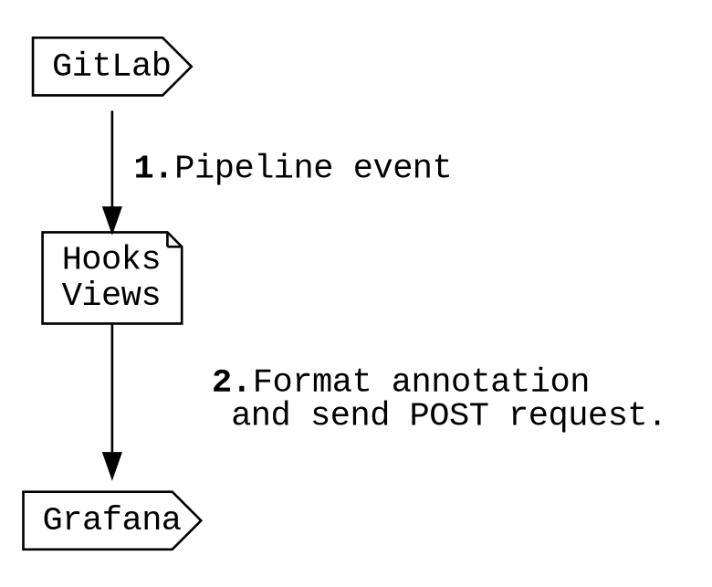

# Architecture

Vision Control is inspired by the [layered OSI model](https://en.wikipedia.org/wiki/OSI_model) in that it is divided
into layers that each deal with different levels of abstraction. The purpose of this is to decouple each layer from each other,
allowing for changes without affecting other parts of the code base.

## Layers

### Layer 1 – HTTP Request

This layer deals directly with HTTP communication and is entirely managed by Django. No logic or data specific to Vision Control is handled here. The requests received by Django is handed to the appropriate `views.py` implementation.

**Sources:** -

### Layer 2 – Body

In `views.py`, we only have knowledge about that we have received a HTTP request and that we are supposed to construct an answer. We don't know anything about what the data looks like and it isn't our responsiblity. The HTTP request body is extracted, and its JSON is deserialized. The task of constructing the response data is delegated to `GrafanaJSONDatasource.`

**Sources:** `vision_control/api/views.py`

### Layer 3 – Grafana Query

Layer 3 deals with parsing Grafana queries, in order to find out which metric or variable that is being requested. This layer is Grafana specific and reponsible for having knowledge about how the [JSON API Grafana Datasource plugin](../grafana/resources.md#json-api-grafana-datasource) formats its requests.

When the [`scope`](payload.md#payload) and [`target`](payload.md#payload) have been identified, the execution is dispatched to an adapter that handles fetching the data. The data will be returned either as a `Table` or as a `Timeseries`. Because the adapters have no knowledge (nor should they) about how such data should be formatted when being returned to Grafana, it is our responsability to do so here.

**Sources:** `vision_control/api/grafana_json_datasource/*`

### Layer 4 – Payload

The final layer knows how to parse the [payload](payload.md) in a Grafana query, which is specific for each metric provided by Vision Control. This is done via [adapters](adapters.md) which acts as the bridge between a 3rd party data source and the rest of the system.

**Sources:** `vision_control/api/adapters/*`

!!! note
    An adapter can be made to work with any data source, no matter whether it is a 3rd-party API or a local class generating some kind of data. If you wish to integrate custom data into Vision Control, the proper way to go about, is to create a new adapter class and register it in `vision_control/api/services.py` as a new metrics- or variables-adapter.

## Structure

The purpose of these graphs is to give an overview of the system and some of the dependencies between sub-systems. It has been simplified and does not contain every detail – for that, you will have to take a look at the actual code 👀

### API

!!! tips
    You can hover over a box to see what file it is located in.

#### Service instantiation

### Hooks

The `hooks` app is used for configuring and receiving webooks from GitLab.

### Annotations

Graphs can be [annotated](https://grafana.com/docs/grafana/latest/dashboards/annotations) in Grafana with important events. In our case, we send all pipeline events from GitLab to Grafana as annotations. This makes it possible to for example, correlate feature usage with deployments (which triggers a pipeline event).

 

  
<i>How annotations look in Grafana.</i>

 

Whenever a webhook with `object_kind = pipeline` is received from GitLab (on `GITLAB_URL`) the `/hooks/gitlab` endpoint is called which in turn will run `vision_control/hooks/views.py:gitlab`. It validates the received data and formats HTML for an annotation. Finally, a `POST` request is made to `GRAFANA_URL` to create the annotation.

