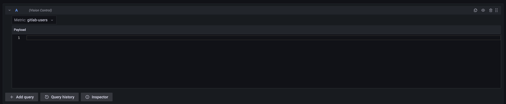
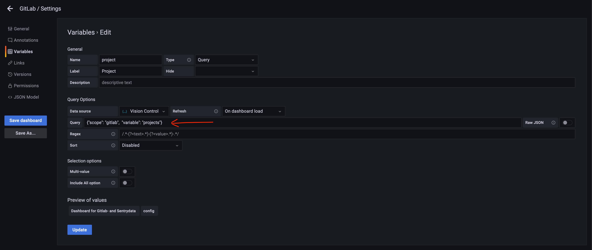

# Adding a new datasource

This chapter outlines what must be done to add a new datasource to the middleware.

## Get your data into Vision Control

Start by finding a way of getting your data into Vision Control. This could, for example, be a REST API that you want to consume, or a Python package that handles communication with the given datasource.

* For GitLab, we use `python-gitlab` which is an already existing Python package.

## Settings

Many data sources must be authenticated and because we want the system to be flexible and secure, all authentication and configuration keys should be settable from the environment. Add your settings to `vision_control/vision_control/settings/base.py`.

For GitLab, we have added `GITLAB_URL`, `GITLAB_ACCESS_TOKEN`, `GITLAB_PROJECT_IDS` and `GITLAB_DEFAULT_PROJECT`.

## Adapters

Your datasource should have no knowledge about how Grafana wants the data to be formatted. Neither should it have knowledge about the types in the `grafana-json-datasource` package. Adapters is the layer between these two locations. They adapt data from datasources to the types wanted by `grafana-json-datasource` (`vision_control/api/grafana-json-datasource/types.py`).

There are two types of adapters expected by `grafana-json-datasource`: *metrics adapters*  and *variables adapters*.

Adapters should return either a `Table` of data or a `Timeseries` according to the types specified in `vision_control/api/grafana-json-datasource/types.py`. Example adapters can be found in `vision_control/api/adapters/gitlab.py`.

### Metrics adapters

Metrics adapter methods should accept two arguments – `payload` and `interval`.

`payload` is specific for each adapter and the expectations on it can be decided freely. It will be a JSON object that the user enters in Grafana's payload field:



`interval` is a specified interval between two timestamps. The returned data should only be within this interval.

### Variables adapters

Variables adapter methods should accept one argument – `data`.

`data` is similar to payload in that it is specific for each adapter and that it can be decided on freely. It will be a JSON object that the user enters in Grafana's Variables Editor `query` field:



## Instantiate dependencies and register them in Vision Control

All instantiation and registration is done in `vision_control/api/services.py`. Instantiate dependencies (such as `python-gitlab`) first and then adapters (such as `gitlab_metrics_adapter`):

```python
...

vision_control_metrics_adapter = VisionControlMetricsAdapter()

...
```

After `GrafanaJSONDatasource`, use `datasource.add_metrics(_)` and `datasource.add_variables(_)` to register your adapters. Every datasource should have **a single scope** which identifies the datasource. For example, the registration of GitLab adapters looks as follows:

```python
datasource.add_metrics(
    "gitlab",
    {
        "commits": gitlab_metrics_adapter.commits,
        "users": gitlab_metrics_adapter.users,
        "pipelines": gitlab_metrics_adapter.pipelines,
        "issues": gitlab_metrics_adapter.issues,
        "merge_requests": gitlab_metrics_adapter.merge_requests,
        "milestones": gitlab_metrics_adapter.milestone,
    },
)

datasource.add_variables(
    "gitlab",
    {
        "projects": gitlab_variables_adapter.projects,
        "branches": gitlab_variables_adapter.branches,
        "labels": gitlab_variables_adapter.labels,
    },
)
```

!!! warning
    Each scope should only be registered once for every adapter type. Succeeding uses would replace the registered adapters.

## 🏆 Finished!

Your datasource is now registered with `GrafanaJSONDatasource` and your metrics and variables should be available in Grafana's `Vision Control` datasource:

<div style="text-align: center;">

</div>
